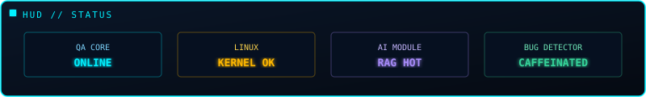
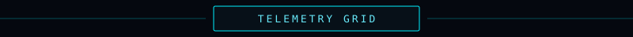
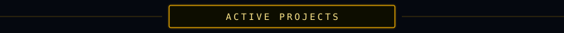

<!--
  SumithRaj05 — JARVIS HUD profile
-->

 

&nbsp;

&nbsp;

<table>
  <tr>
    <td>
      
    </td>
    <td>
      
    </td>
  </tr>
  <tr>
    <td colspan="2" align="center">
      
    </td>
  </tr>
</table>

 

&nbsp;

 

&nbsp;

 

&nbsp;

